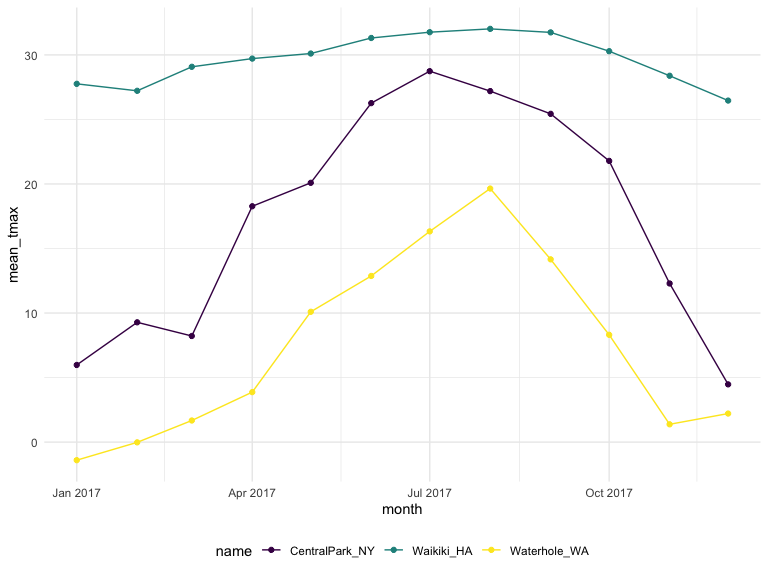

Exploratory Data Analysis
================
Jessica Lavery
9/26/2019

``` r
weather_df = 
  rnoaa::meteo_pull_monitors(c("USW00094728", "USC00519397", "USS0023B17S"),
                      var = c("PRCP", "TMIN", "TMAX"), 
                      date_min = "2017-01-01",
                      date_max = "2017-12-31") %>%
  mutate(
    name = recode(id, USW00094728 = "CentralPark_NY", 
                      USC00519397 = "Waikiki_HA",
                      USS0023B17S = "Waterhole_WA"),
    tmin = tmin / 10,
    tmax = tmax / 10,
    month = lubridate::floor_date(date, unit = "month")) %>%
  select(name, id, date, month, everything())
```

    ## Registered S3 method overwritten by 'crul':
    ##   method                 from
    ##   as.character.form_file httr

    ## Registered S3 method overwritten by 'hoardr':
    ##   method           from
    ##   print.cache_info httr

    ## file path:          /Users/jessica/Library/Caches/rnoaa/ghcnd/USW00094728.dly

    ## file last updated:  2019-09-26 10:27:16

    ## file min/max dates: 1869-01-01 / 2019-09-30

    ## file path:          /Users/jessica/Library/Caches/rnoaa/ghcnd/USC00519397.dly

    ## file last updated:  2019-09-26 10:27:30

    ## file min/max dates: 1965-01-01 / 2019-09-30

    ## file path:          /Users/jessica/Library/Caches/rnoaa/ghcnd/USS0023B17S.dly

    ## file last updated:  2019-09-26 10:27:35

    ## file min/max dates: 1999-09-01 / 2019-09-30

## `group_by` and counting

``` r
weather_df %>% 
  group_by(name, month)
```

    ## # A tibble: 1,095 x 7
    ## # Groups:   name, month [36]
    ##    name           id          date       month       prcp  tmax  tmin
    ##    <chr>          <chr>       <date>     <date>     <dbl> <dbl> <dbl>
    ##  1 CentralPark_NY USW00094728 2017-01-01 2017-01-01     0   8.9   4.4
    ##  2 CentralPark_NY USW00094728 2017-01-02 2017-01-01    53   5     2.8
    ##  3 CentralPark_NY USW00094728 2017-01-03 2017-01-01   147   6.1   3.9
    ##  4 CentralPark_NY USW00094728 2017-01-04 2017-01-01     0  11.1   1.1
    ##  5 CentralPark_NY USW00094728 2017-01-05 2017-01-01     0   1.1  -2.7
    ##  6 CentralPark_NY USW00094728 2017-01-06 2017-01-01    13   0.6  -3.8
    ##  7 CentralPark_NY USW00094728 2017-01-07 2017-01-01    81  -3.2  -6.6
    ##  8 CentralPark_NY USW00094728 2017-01-08 2017-01-01     0  -3.8  -8.8
    ##  9 CentralPark_NY USW00094728 2017-01-09 2017-01-01     0  -4.9  -9.9
    ## 10 CentralPark_NY USW00094728 2017-01-10 2017-01-01     0   7.8  -6  
    ## # … with 1,085 more rows

``` r
weather_df %>% 
  group_by(name, month) %>% 
  summarize(n_obs = n())
```

    ## # A tibble: 36 x 3
    ## # Groups:   name [3]
    ##    name           month      n_obs
    ##    <chr>          <date>     <int>
    ##  1 CentralPark_NY 2017-01-01    31
    ##  2 CentralPark_NY 2017-02-01    28
    ##  3 CentralPark_NY 2017-03-01    31
    ##  4 CentralPark_NY 2017-04-01    30
    ##  5 CentralPark_NY 2017-05-01    31
    ##  6 CentralPark_NY 2017-06-01    30
    ##  7 CentralPark_NY 2017-07-01    31
    ##  8 CentralPark_NY 2017-08-01    31
    ##  9 CentralPark_NY 2017-09-01    30
    ## 10 CentralPark_NY 2017-10-01    31
    ## # … with 26 more rows

### `n_distinct`

``` r
weather_df %>% 
  group_by(month) %>% 
  summarize(n_obs = n(),
            n_unique = n_distinct(date))
```

    ## # A tibble: 12 x 3
    ##    month      n_obs n_unique
    ##    <date>     <int>    <int>
    ##  1 2017-01-01    93       31
    ##  2 2017-02-01    84       28
    ##  3 2017-03-01    93       31
    ##  4 2017-04-01    90       30
    ##  5 2017-05-01    93       31
    ##  6 2017-06-01    90       30
    ##  7 2017-07-01    93       31
    ##  8 2017-08-01    93       31
    ##  9 2017-09-01    90       30
    ## 10 2017-10-01    93       31
    ## 11 2017-11-01    90       30
    ## 12 2017-12-01    93       31

### `count`

Count shortens using `group_by` and `summarize`.

``` r
# default varible name for count is n
weather_df %>% 
  count(name)
```

    ## # A tibble: 3 x 2
    ##   name               n
    ##   <chr>          <int>
    ## 1 CentralPark_NY   365
    ## 2 Waikiki_HA       365
    ## 3 Waterhole_WA     365

``` r
# can also customize this
weather_df %>% 
  count(name, name = "n_days")
```

    ## # A tibble: 3 x 2
    ##   name           n_days
    ##   <chr>           <int>
    ## 1 CentralPark_NY    365
    ## 2 Waikiki_HA        365
    ## 3 Waterhole_WA      365

\*\* Never use base R’s table() function \*\*

``` r
tbl <- weather_df %>% 
  pull(name) %>% 
  table()

# print the result
tbl
```

    ## .
    ## CentralPark_NY     Waikiki_HA   Waterhole_WA 
    ##            365            365            365

``` r
# result is of class "table", not a data frame! 
class(tbl)
```

    ## [1] "table"

``` r
# same as table(weather_df$name)
```

## Kable

Let’s make a nice table

``` r
weather_df %>% 
  count(name) %>% 
  knitr::kable()
```

| name            |   n |
| :-------------- | --: |
| CentralPark\_NY | 365 |
| Waikiki\_HA     | 365 |
| Waterhole\_WA   | 365 |

## 2x2 tables

``` r
weather_df %>% 
  filter(name != "Waikiki_HA") %>% 
  mutate(
    cold = case_when(
      tmax < 5  ~ "cold",
      tmax >= 5 ~ "not cold",
      TRUE      ~ ""
    )
  ) %>% 
  group_by(name, cold) %>% 
  count() %>% 
  pivot_wider(
    names_from = cold,
    values_from = n
  )
```

    ## # A tibble: 2 x 3
    ## # Groups:   name, cold [2]
    ##   name            cold `not cold`
    ##   <chr>          <int>      <int>
    ## 1 CentralPark_NY    44        321
    ## 2 Waterhole_WA     172        193

Alternative approach using `janitor::tabyl()`

<https://cran.r-project.org/web/packages/janitor/vignettes/tabyls.html>

``` r
weather_df %>% 
  filter(name != "Waikiki_HA") %>% 
  mutate(
    cold = case_when(
      tmax < 5  ~ "cold",
      tmax >= 5 ~ "not cold",
      TRUE      ~ ""
    )
  ) %>% 
  janitor::tabyl(name, cold) %>%
  janitor::adorn_percentages("row") %>%
  janitor::adorn_pct_formatting(digits = 2) %>%
  janitor::adorn_ns() %>% 
  kable()
```

| name            | cold         | not cold     |
| :-------------- | :----------- | :----------- |
| CentralPark\_NY | 12.05% (44)  | 87.95% (321) |
| Waterhole\_WA   | 47.12% (172) | 52.88% (193) |

## general summaries

By deafult, any time that you compute a numeric summary of something
that includes an NA, R returns an NA. Options: drop these rows from the
data, modify function to ignore NAs in computation via na.rm = TRUE.
Don’t do the latter option by default, look at the missing values and
make sure you understand what’s going on.

Can also pipe in the summary into ggplot to create a visual of the
summary that was created.

``` r
weather_df %>% 
  group_by(name, month) %>%
  summarize(
    n = n(),
    mean_tmax = mean(tmax, na.rm = TRUE),
    sd_tmax = sd(tmax, na.rm = TRUE),
    median_prcp = median(prcp, na.rm = TRUE)
  ) %>%
  ggplot(aes(x = month, y = mean_tmax, color = name)) + 
    geom_point() + geom_line() + 
    theme(legend.position = "bottom")
```



### user-friendly summaries

The output won’t be in “tidy” format, but will be more user-friendly.

``` r
weather_df %>% 
  group_by(name, month) %>% 
  summarize(
    mean_tmax = mean(tmax, na.rm = TRUE)
  ) %>% 
  pivot_wider(
    names_from = name,
    values_from = mean_tmax) %>% 
  knitr::kable()
```

| month      | CentralPark\_NY | Waikiki\_HA | Waterhole\_WA |
| :--------- | --------------: | ----------: | ------------: |
| 2017-01-01 |        5.977419 |    27.75806 |   \-1.4000000 |
| 2017-02-01 |        9.282143 |    27.21786 |   \-0.0178571 |
| 2017-03-01 |        8.222581 |    29.07742 |     1.6741935 |
| 2017-04-01 |       18.273333 |    29.71333 |     3.8733333 |
| 2017-05-01 |       20.090323 |    30.10690 |    10.0967742 |
| 2017-06-01 |       26.263333 |    31.31000 |    12.8733333 |
| 2017-07-01 |       28.738710 |    31.76000 |    16.3258065 |
| 2017-08-01 |       27.193548 |    32.01613 |    19.6451613 |
| 2017-09-01 |       25.433333 |    31.74333 |    14.1600000 |
| 2017-10-01 |       21.787097 |    30.28710 |     8.3129032 |
| 2017-11-01 |       12.290000 |    28.38333 |     1.3800000 |
| 2017-12-01 |        4.474194 |    26.46129 |     2.2129032 |

### ungrouping

``` r
weather_df %>% 
  group_by(name) %>% 
  ungroup()
```

    ## # A tibble: 1,095 x 7
    ##    name           id          date       month       prcp  tmax  tmin
    ##    <chr>          <chr>       <date>     <date>     <dbl> <dbl> <dbl>
    ##  1 CentralPark_NY USW00094728 2017-01-01 2017-01-01     0   8.9   4.4
    ##  2 CentralPark_NY USW00094728 2017-01-02 2017-01-01    53   5     2.8
    ##  3 CentralPark_NY USW00094728 2017-01-03 2017-01-01   147   6.1   3.9
    ##  4 CentralPark_NY USW00094728 2017-01-04 2017-01-01     0  11.1   1.1
    ##  5 CentralPark_NY USW00094728 2017-01-05 2017-01-01     0   1.1  -2.7
    ##  6 CentralPark_NY USW00094728 2017-01-06 2017-01-01    13   0.6  -3.8
    ##  7 CentralPark_NY USW00094728 2017-01-07 2017-01-01    81  -3.2  -6.6
    ##  8 CentralPark_NY USW00094728 2017-01-08 2017-01-01     0  -3.8  -8.8
    ##  9 CentralPark_NY USW00094728 2017-01-09 2017-01-01     0  -4.9  -9.9
    ## 10 CentralPark_NY USW00094728 2017-01-10 2017-01-01     0   7.8  -6  
    ## # … with 1,085 more rows

### grouping & mutating

All mutating will be group-specific.

``` r
weather_df %>% 
  group_by(name) %>% 
  mutate(
    mean_tmax = mean(tmax, na.rm = TRUE),
    centered_tmax = tmax - mean_tmax
  ) %>% 
  ggplot(aes(x = date, y = centered_tmax, color = name)) +
  geom_point()
```


#### Window functions in grouped mutates

To get the rank in terms of order (first coldest day, 2nd, etc.), want
to take all tmax values and sort and rank.

``` r
# look at ?min_rank for description of windowed rank functions

weather_df %>% 
  group_by(name, month) %>% 
  mutate(
    tmax_rank = min_rank(tmax),
    tmax_rank_desc = min_rank(desc(tmax))
  ) %>% 
  arrange(name, month, tmax_rank) %>% 
  filter(tmax_rank == 1) # to get the coldest day in each location in each month
```

    ## # A tibble: 42 x 9
    ## # Groups:   name, month [36]
    ##    name  id    date       month       prcp  tmax  tmin tmax_rank
    ##    <chr> <chr> <date>     <date>     <dbl> <dbl> <dbl>     <int>
    ##  1 Cent… USW0… 2017-01-09 2017-01-01     0  -4.9  -9.9         1
    ##  2 Cent… USW0… 2017-02-10 2017-02-01     0   0    -7.1         1
    ##  3 Cent… USW0… 2017-03-15 2017-03-01     0  -3.2  -6.6         1
    ##  4 Cent… USW0… 2017-04-01 2017-04-01     0   8.9   2.8         1
    ##  5 Cent… USW0… 2017-05-13 2017-05-01   409  11.7   7.2         1
    ##  6 Cent… USW0… 2017-06-06 2017-06-01    15  14.4  11.1         1
    ##  7 Cent… USW0… 2017-07-25 2017-07-01     0  21.7  16.7         1
    ##  8 Cent… USW0… 2017-08-29 2017-08-01    74  20    16.1         1
    ##  9 Cent… USW0… 2017-09-30 2017-09-01     0  18.9  12.2         1
    ## 10 Cent… USW0… 2017-10-31 2017-10-01     0  13.9   7.2         1
    ## # … with 32 more rows, and 1 more variable: tmax_rank_desc <int>

### lag

Look at change in max temperature from current day to next day

Opposite of the lag function is the lead function.

``` r
weather_df %>%
  group_by(name)  %>% 
  arrange(name, date) %>% 
  mutate(one_day_tmax_change = tmax - lag(tmax)) %>% summarize(sd_daily_chnge = sd(one_day_tmax_change, na.rm = TRUE))
```

    ## # A tibble: 3 x 2
    ##   name           sd_daily_chnge
    ##   <chr>                   <dbl>
    ## 1 CentralPark_NY           4.45
    ## 2 Waikiki_HA               1.23
    ## 3 Waterhole_WA             3.13
